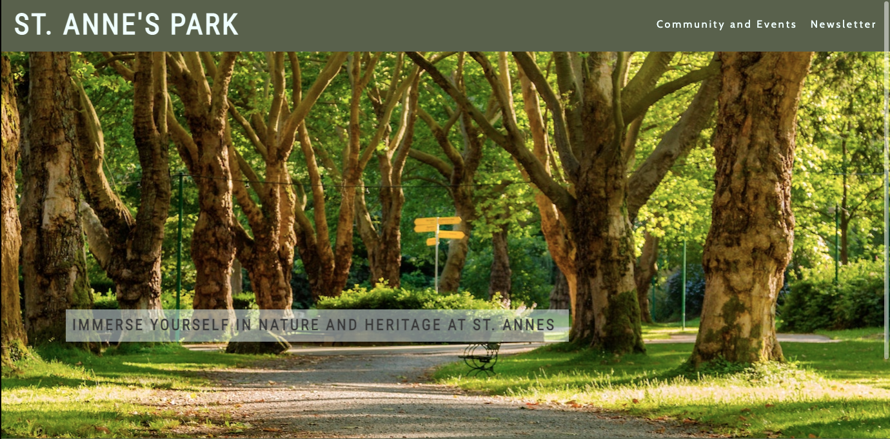
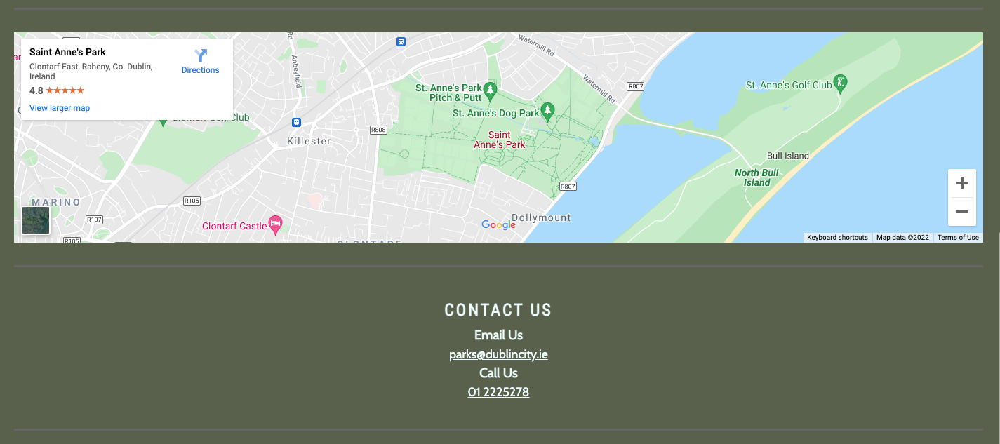
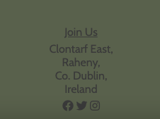
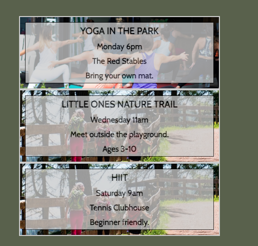
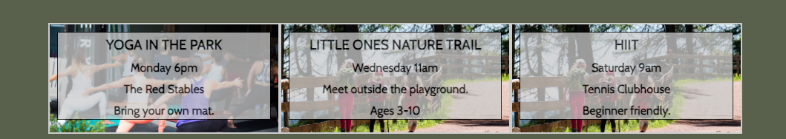

# St. Annes Park 

This project designs a modern website for St. Annes Park in North Dublin, which previously did not have a website or any centralised information on events. In compiling information related to the park, this website hopes to encourage both current park users and new users to join the community events that happen at the park. As the world begins to open up again, it is of utmost importance that we come together and socialise, ensuring that the community is healthy and happy. 

[https://ellentreacy.github.io/st-annes-dublin/](https://ellentreacy.github.io/st-annes-dublin/)

As a current user of the park, and as someone looking to meet new people and socialise following the lonley period of time that was the pandemic, I found it difficult to find information on what groups were on in the park, and how to join them. Currently, information is dissemited via FaceBook and other social media, and word of mouth. By making information readily available, more people will be able to join the activities. 

## Features 

### Existing Features
- #### Home Page
- Header
  - Logo
    - The Logo is on all three pages. It is repsonsive. The logo acts as a link back to the home page, rather than creating another link in the navigation bar - this feels more intuitive. 
  - Navigation Bar
    - The Navigation Bar has links to the Community and Events page, and the Newsletter sign up page. 

- Hero Image
  - A striking photo of St. Annes was chosen for the hero image. It has a cover text which is transparent to aid reading. The cover text was chosen to encourage users to the park 
- A small blurb was inluded under the hero image to tell people briefly about the park. 

- Map and Contact
  - A google map was inserted using an iframe. this is clickable and interactive
  - Below this is a contact section with links to emails and phone numbers

- Footer 
  - The footer contains an address, links to social media and a link to the careers page at Dublin City Council
  - the footer was kept clean as to not clutter the page

  

- #### Events Page
  - Latest Events
    - latest events in the park are showcased in the top row
    - These have an image covered by a transparent text box
    - this is repsonsive on smaller screens as it switches from a row to a column

    
    
  - The lastest events and the community groups are separated by a small blurb about the groups
  - the community events feature a circular image and a small written description of the group so as to let people know about the group. 
  - the images and text alternate sides for each group to enhance the vibrancy of the page

      

### Features to implement
- A form to sign up for each group
- an about section for the history of St Annes, and information regardign the geology, flora and fauna

## Testing

The website has been deployed and tested on most common screen sizes. There are issues with the design on screen sizes smaller than 600px for the events page. Unfortunately, I did not have time to understand how to fix this. In the future, I would like to implement responsiveness using FlexBoxs rather than manually changing sizes. I will attempt to fix all issues with responsiveness at a future date. 

## Validator

- HTML
  - No error occur after amending every page with the official W3C Validator

- CSS
  - No errors occured with the official (Jigsaw) Validator 

## Deployment
- The page was deployed using GitHub pages. 
- Here is a link, which is also at the beginning of this ReadMe.md

[link to St Annes](https://ellentreacy.github.io/st-annes-dublin/)

## Credits

The icons used were from [Font Awesome](https://fontawesome.com/)
Fonts used were from [Google Fonts](https://fonts.google.com/)
map from [google maps](https://www.google.com/maps)
### Image Credits
- Coffee Image [LidiaSt from PixaBay](https://pixabay.com/photos/black-coffee-frozen-winter-outside-4784772/)
- Children in Nature [SasSint on PixaBay](https://pixabay.com/photos/boy-scout-scouting-asia-the-same-1822631/)
- Seedling Image [Jag2020 on PixaBay](https://pixabay.com/photos/seedling-gardening-greenhouse-5009286/)
- Squirrel Image [NadiaTighe on PixaBay](https://pixabay.com/photos/squirrel-red-wildlife-nature-2827760/)
- HIIT [Gabin vallet on PixaBay](https://pixabay.com/photos/workout-man-training-sports-5914643/)
- Hiking image [MaBras on PixaBay](https://pixabay.com/photos/children-girl-hiking-trail-4355469/)
- Yoga image [Dylan Gillis on UnSplash](https://unsplash.com/photos/YJdCZba0TYE)
- hero image [Mike Benna on Unsplash](https://unsplash.com/photos/SBiVq9eWEtQ)